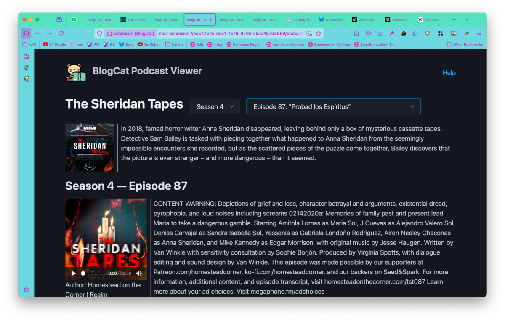
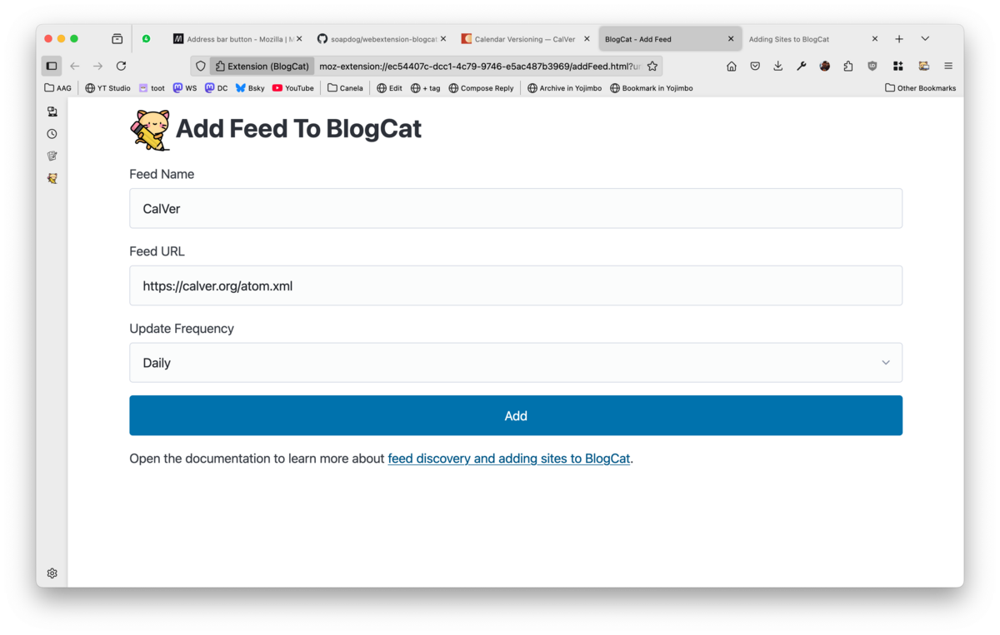

# BlogCat :id=readme

> A handy add-on that makes feed reading & blogging a first-class citizen on Firefox.

To learn how to use this add-on, go to our [getting started guide](/quickstart). Using the sidebar on the left, you can find out how BlogCat integrates with Firefox, how to read and subscribe to blogs, and how to be a part of the conversation by adding your blogging and microblogging accounts.

# Screenshots

_Reading Feeds._

_Listening to a podcast._

_Subscribing to a WebSite._

There is a lot more to BlogCat than what you can see on these brief screenshots. Check out the documentation for in-deep guides on how to use it.

# Inspiration

This addon wouldn't exist if it was not for [FraidyCat](https://fraidyc.at) and [Rad Reader](https://cblgh.itch.io/rad-reader). They paved the way for BlogCat to find it's own path. If you'd rather have an app (or use a different browser), you might want to check them out.

# Ethos of BlogCat

The Web should be made by people and for people. We need tools that champion a human-centric web and the best way to do it is to foster an interconnected blogosphere. BlogCat aims to reduce friction between web browsing and blogging by making it easy to subscribe to blogs and also post. The Web should be a conversation.

Like the feed readers that inspired it, BlogCat strives for a calm experience. It doesn't fetch data in the background, it doesn't display badges or notifications. Use it on your time and terms. It only fetches blogs when you open the reader. Instead of a _river of news_ paradigm, it simply shows the recent updated blogs and few post titles. No single website can dominate the screen by overposting.

Instead of simply embedding a full application into the browser, BlogCat augments Firefox features. Clicking on a post will either open it on a new tab or using Firefox Reader (user configurable option). BlogCat is a user agent and a Firefox Add-on, it is not an app. It adds to Firefox instead of colonising it with itself.

# Privacy Policy

This WebExtension does not collect or transmit any personal data. Access Tokens added by the user are only sent to the servers the user added.

# Permissions

BlogCat asks for the following permissions.

- **scripting:** used to run JavaScript in the current tab to detect feeds by looking for `<link>`.
- **tabs:** used to be able create new tabs for the various features
- **activeTab:** used to access the current tab so it can look for feeeds.
- **clipboardWrite:** used by the contextual menu to copy quotes and links to be used to compose new posts.
- **storage:** used for storing data, basically settings, accounts, and feeds.
- **unlimitedStorage:** used because some feeds are large and you might be subsribing to a lot of websites.
- **contextMenus:** to be able to create contextua-menus for text selection. Mostly used to facilitate quoting data in new posts.
- **history:** used so that it can detect URL changes for YouTube channel feed detection. While you navigate on YouTube, the normal activeTab inspection doesn't trigger, this is used instead.
- **downloads:** to be able to export OPML files.

# License

MIT

<a href="https://www.flaticon.com/free-icons/construction-and-tools" title="construction and tools icons">Construction and tools icons created by Freepik - Flaticon</a>

<a href="https://www.flaticon.com/free-icons/cat" title="cat icons">Cat icons created by Freepik - Flaticon</a>
