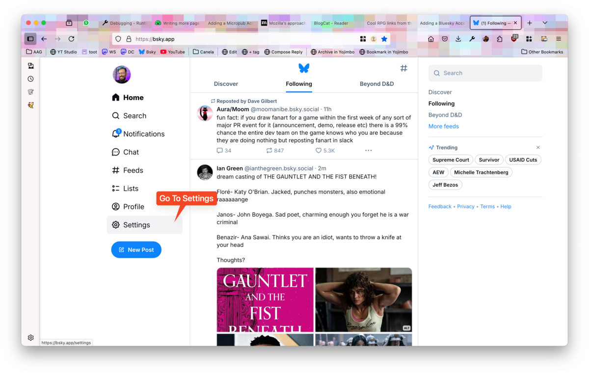
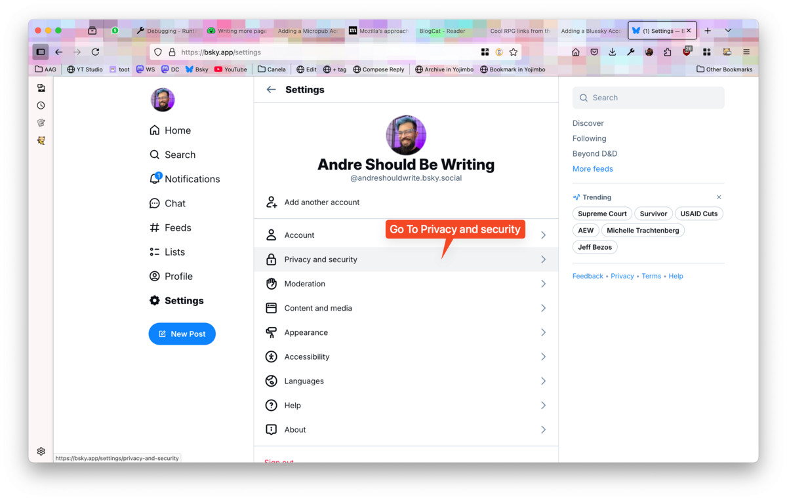
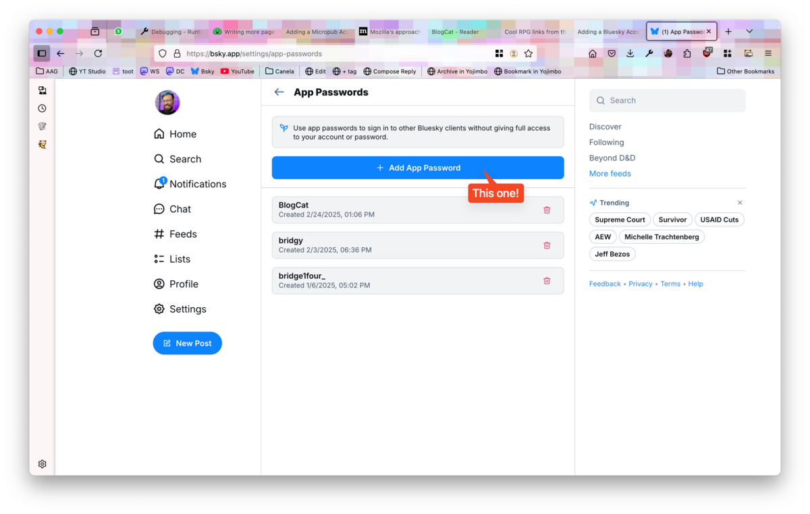
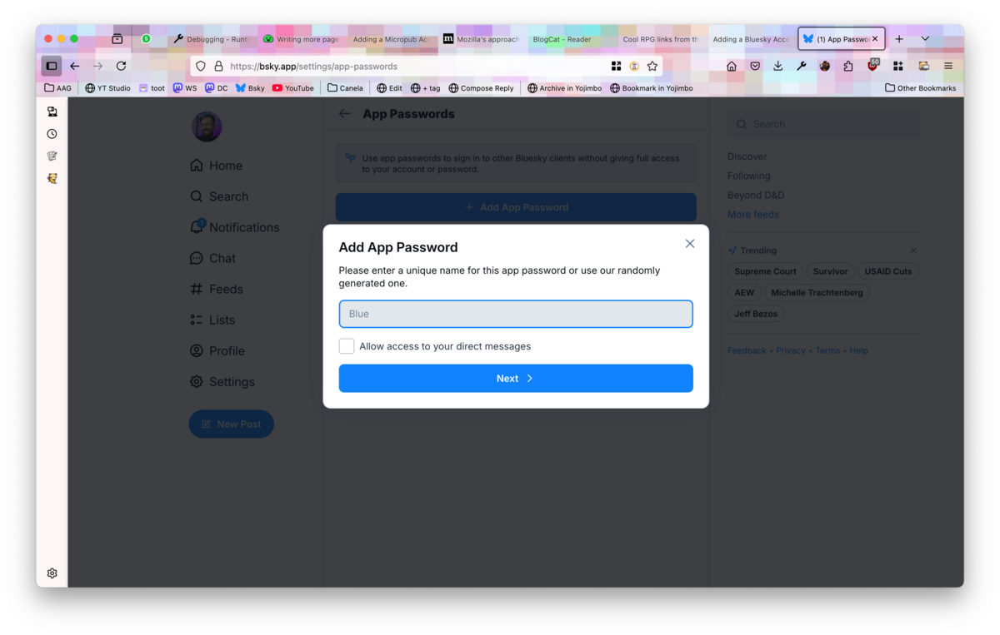
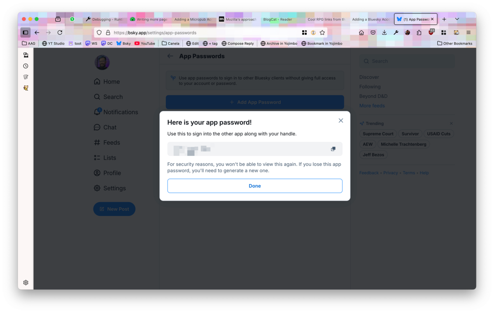
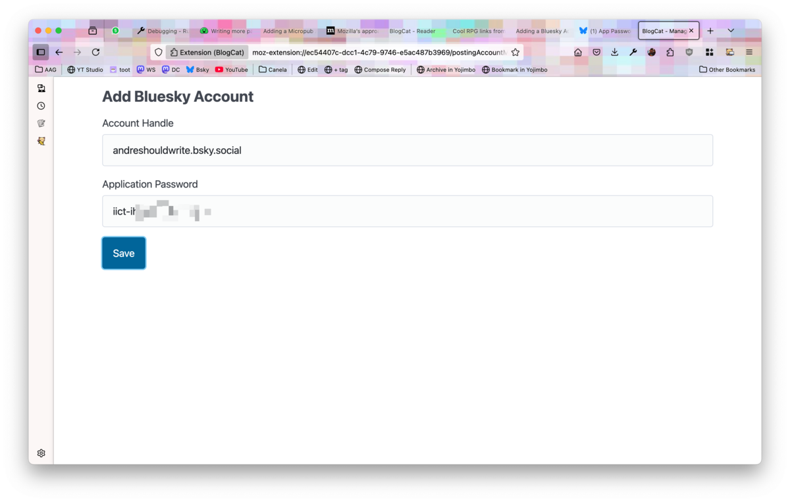

[Bluesky](https://bsky.app) is a microblogging service that is getting a lot of traction lately. Even though it is a decentralised web service, most users access it over the official app and do not host their own data repository. Bluesky uses the [AT Protocol](https://en.wikipedia.org/wiki/AT_Protocol) to provide social networking services, but most apps integrating with it use the [official SDKs or the Web APIs](https://docs.bsky.app/) provided by the official app.

A user on Bluesky can create an _app password_ and use it with third-party apps to allow them to access their account.

> **Attention:** You should not reuse app password between apps. Create one application password for each app you use.

You can add as many Bluesky accounts to BlogCat as you want.

## Creating an application password

After creating your Bluesky account, go to _Settings_ on the sidebar.

Then go to _Privacy and Security_ as shown in the screenshot below.

After that select _App passwords_.

And use the blue button labeled _+ Add App Password_ to create a new application password.

The dialog will ask for the name for the application, you can name it whatever you want. Naming it with the same name as the application you intend to use it for makes it easy to manage the passwords later.

> **Attention:** Don't give BlogCat access to your direct messages. BlogCat doesn't use such features and you stay safer that way.

After clicking _Next_, Bluesky will show you your new application password. **Copy it for it won't be shown again.**

## Adding the application password to BlogCat

Using the toolbar button, go to _Manage Posting Accounts_.

Click on _Add Bluesky Account_.

Fill in your Bluesky handle and your application password.

