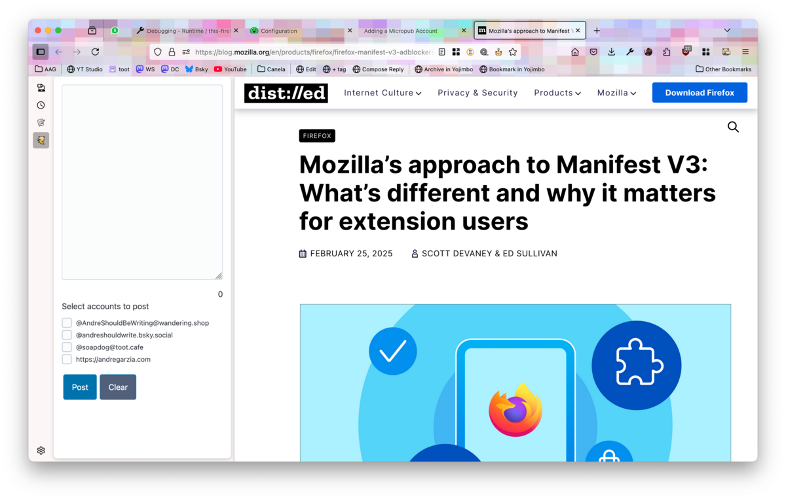

To write a new post, click the toolbar button and select the _New Post_ button (it is easy, it is the big blue one).

That will open the _editor page_, depending on your configuration that will either open as a sidebar or a new tab. The default configuration is to open as a sidebar.

> The advantage of having it as a sidebar is that you can switch the active tab while keeping the sidebar open. This allows you to keep browsing the Web while you work on your post.

The editor has a large text input area to write your post and a list showing your posting accounts. Use the checkboxes to select which accounts you want to post to. You can post to as many accounts you want at the same time. That is quite handy if you're trying to post to cross-post to Mastodon and Bluesky for example.

If you select a Micropub account, the editor will enable a title field for the post. The title field has no effect on Mastodon or Bluesky posts.

Below the text editing area there is a character counter. BlogCat does not enforce any limits on the lenght of the post since that varies from server to server on the fediverse and micropub. It is up to you to make sure you're making sure you don't overstep such limits (in the future I'll add some checks).

There are two buttons, one for posting and one for clearing up the editor for a new post.

Once you post, the editor will show the links for each post under the selected account.

You can add images to your posts by clicking the `Add Image` button. Bluesky supports only up to four images. Mastodon supports more but I suspect that depends on the server. Once you add an image, it shows as a thumbnail below the editor. Click a thumbnail to add alt text for accessibility purposes to the image.

> **important:** Be aware that BlogCat does not clear EXIF fields. 
