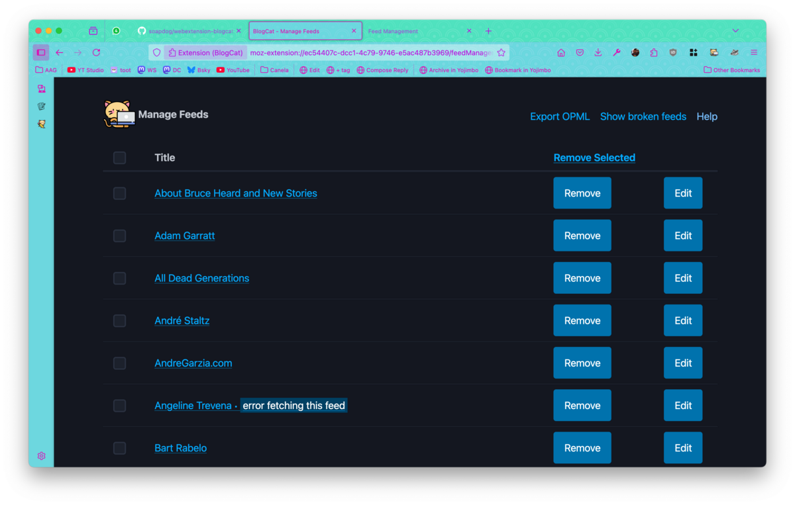
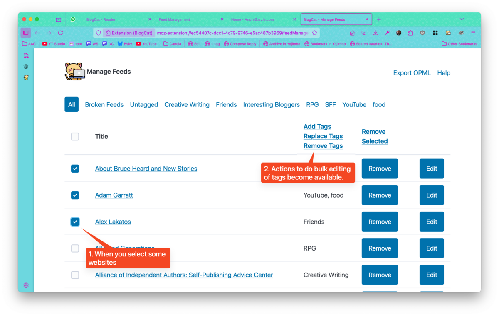

You can access the _feed management page_ using the browser toolbar button and clicking on _Manage feeds_.

## Feed management

On the feed management page, you'll see a list of all websites you're currently subscribing. On top, you'll a _navigation menu_ with all the _tags_ you have:

- _All:_ shows all the websites you subscribed to.
- _Broken Feeds:_ shows the feeds that BlogCat is having trouble loading. This might be a bug on their end or hours. In doubt, use the _browser toolbar_ to report the broken feed to me using _Issues on Github_
- _Untagged:_ websites you subscribed to but that have no tags assigned to them.
- _individual tags:_ besides the options above, BlogCat will add each tag in you have as a link there to help you find the feed you need.

You can click the website title to access the website or use the _remove button_ to unsubscribe. Clicking the _edit_ button will open the [Add Feed Page](feeddiscovery.md)

Sometimes websites get broken and BlogCat can't access their feed. Instead of trying every time, BlogCat keeps track of how many times the feed failed and will stop trying to access it after three times (you can change that value in the _add-on preferences page_).

Use the _Broken Feeds_ link a the top of the page to list what websites got broken feeds.

## Tag management

You can use the _edit_ button to go to the _Add feed page_ and edit the tags for an individual website. You can also select multiple websites using the _check boxes_ and then BlogCat will display a _bulk tag management list of actions_ on top of the tag column. Use them to add, replace, or remove tags for multiple websites at the same time.

## Exporting a subscription list

To export your list of subscriptions, click on _Export OPML_. This will download a `blogcat.opml` to your download folder. If you selected some feeds before clicking _Export OPML_, BlogCat will export only the selected feeds and ask you for a filename. Remember to use a _.opml_ file extension when specifying your own filename.

There are many things you can do with it:

- Add it to your blog with a `<link rel="blogroll">` such as `<link rel="blogroll" title="Blogroll" href="/.well-known/recommendations.opml">`.
- Share it with friends!
- Import it into another feed reader you like.
