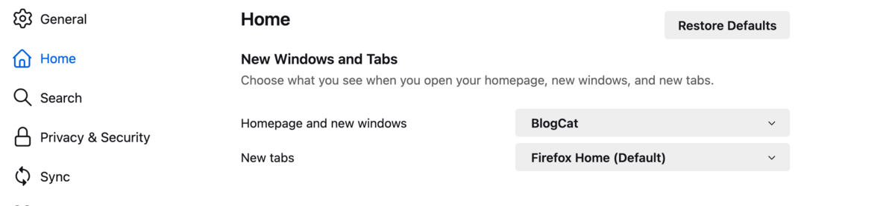

BlogCat can be set as the default option for your _homepage_ or _new tab_ in Firefox settings.

When you set it like that, Firefox will open the [BlogCat reader page](/reader) when going to the homepage or new tab.
