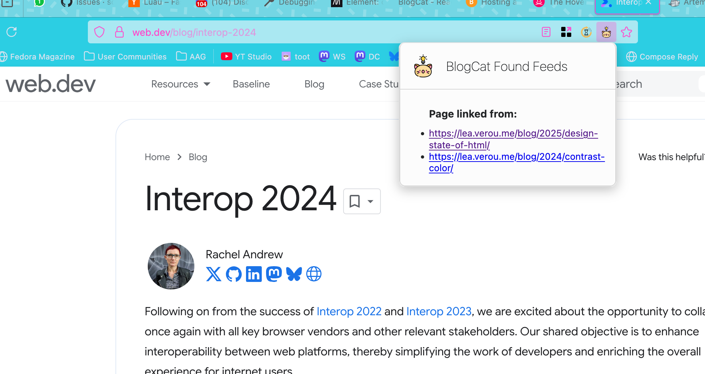

As far as I am aware, link graphs were pioneered by [Artemis calm web reader](https://artemis.jamesg.blog/), you can read about their take on it as [Artemis Link Graph](https://artemis.jamesg.blog/extension). In their own words:

> Artemis Link Graph is a web extension that tells you when the page you are viewing has been linked to in a post from a website you follow on Artemis.
> 
> You can use this extension to discover what websites you enjoy are saying about different web pages.
>
> &mdash; _Source: [Artemis Link Graph | Artemis](https://artemis.jamesg.blog/extension)_

It is a very near feature and I decided to implement the same. Still, credit is due and they did it first.

In Blogcat, the linkgraph surfaces as a page action. If you're viewing a page that has been linked in a post from a site you follow you'll see the little cat popup.

If you click the popup, you'll see the list of posts that linked to the page you're viewing.

