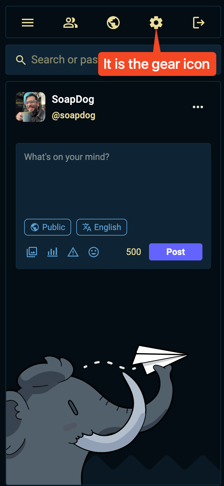
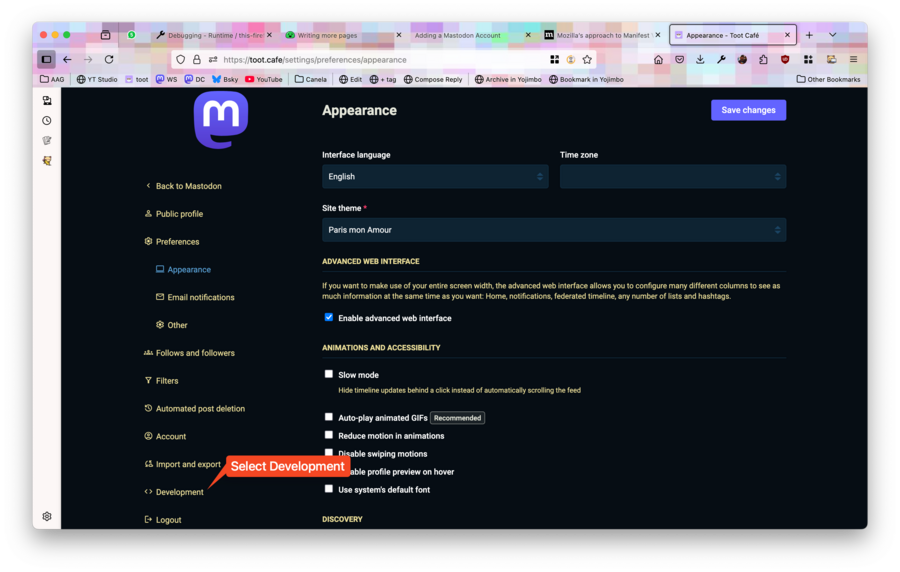
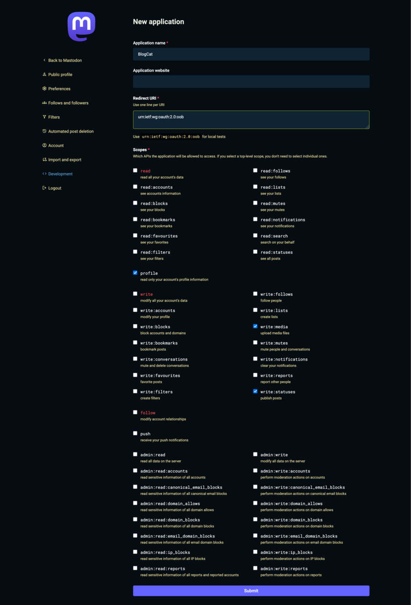
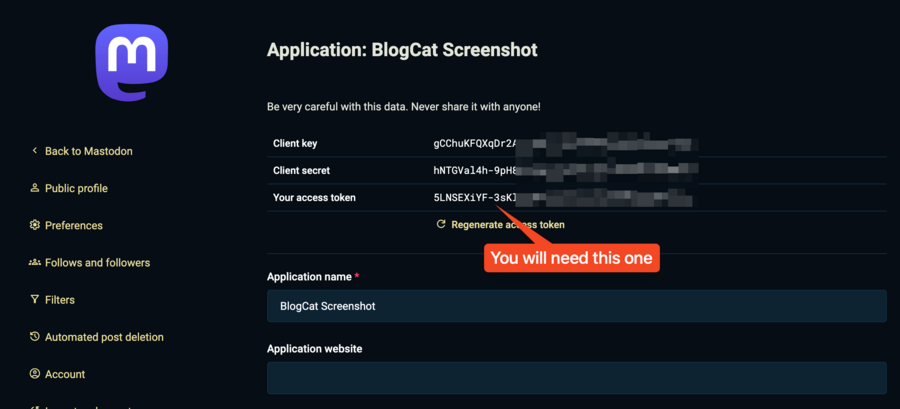
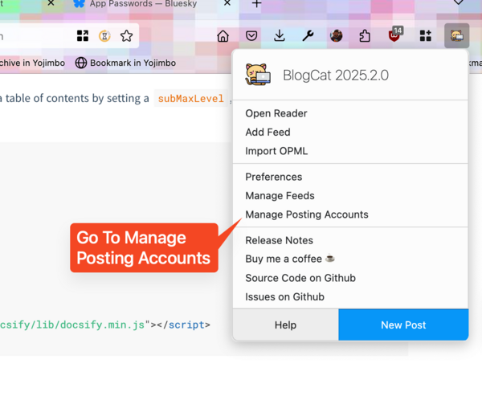
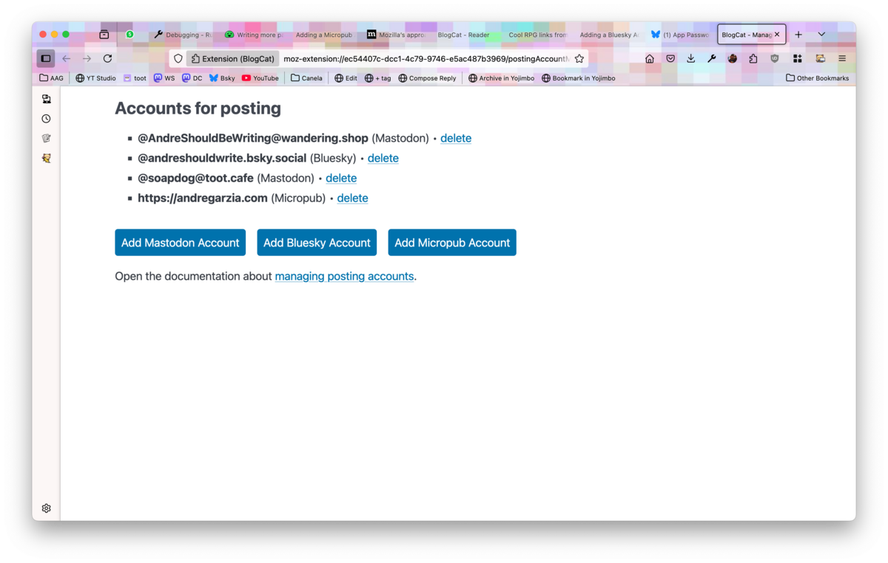
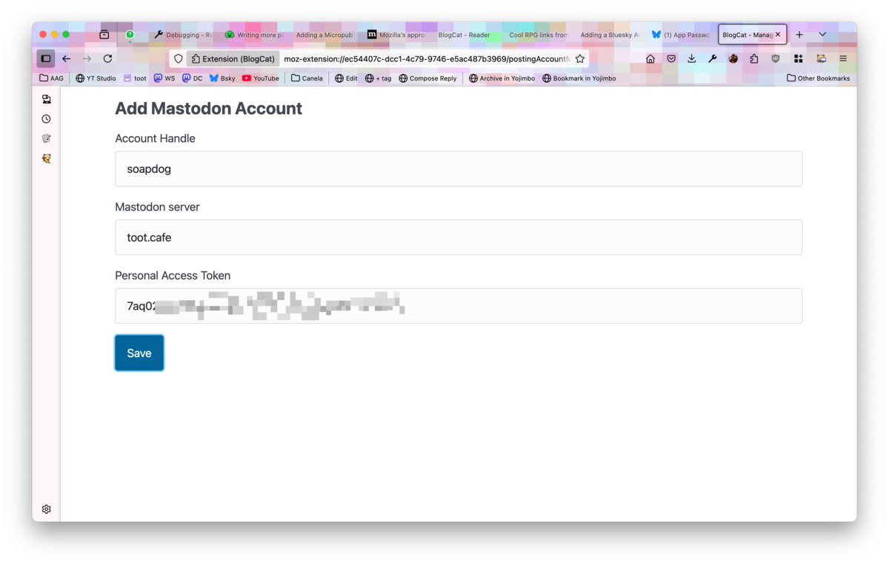

[Mastodon](https://joinmastodon.org) is a FOSS decentralised microblogging service. It is the most popular federated microblogging platform out there (according to the voices in my head). Unlike centralised social networks, there are different servers you can join to be a part of the federation. Regardless of the server you choose to join, you will be able to keep up and interact with people from other servers (unless your server is blocking them for some reason). Mastodon is part of the [fediverse](https://en.wikipedia.org/wiki/Fediverse) which is a constellation of different services and softwares that can federate among themselves using the [ActivityPub protocol](https://en.wikipedia.org/wiki/ActivityPub).

BlogCat uses [Mastodon API](https://docs.joinmastodon.org/api/) to talk to Mastodon servers, it is not using ActivityPub C2S. This means that when you add a Mastdon account to BlogCat it needs to be either Mastodon or a service that provides the same API.

You can add multiple Mastodon accounts to BlogCat.

To add a Mastodon account to BlogCat, we'll use _Personal Access Tokens_.

## Getting a personal access token

Open the Web interface for your Mastodon account and go into _Preferences_.

Then using the sidebar, go into _Development_.

Click the blue button labeled _New application_ to create a new application entry.

> **Attention:** You should not reuse personal access tokens between apps. Create one application for each app you use.

> **Trivia:** Some Mastodon apps (actually most of them) use OAuth instead and provide an alternative way to log into Mastodon. We're using personal access tokens because instead of making you access Mastodon using our application keys, we're letting you be in control of the tokens and keys yourself. That is safer for you.

Fill in a name for your application, we suggest BlogCat so that you know where you're adding that personal access token. Leave the other input fields as they are. Make sure to check:

- profile
- write:statuses
- write:media

At the moment, BlogCat only writes new statuses, but in the future I want to show avatars and upload images, so you might as well give the app permission for that. If you don't and I add the feature later, you'll need to edit the personal access token to grant it more permissions.

Create your application by clicking _Submit_. After creation, you'll see the list of applications. Click on your newly created application to see the tokens.

You can see there are three tokens there. The first two are used if you're developing applications for third-party use. The one labeled _Your access token_ is a _personal access token_ that you can use in BlogCat to post on your behalf. When you add that token to an app, it gets permissions to use the scopes you selected when you created the application token.

> **Attention:** Do not share this token! Anyone using it can post as you.

## Adding the personal access token to BlogCat

Using the toolbar button, go to _Manage Posting Accounts_.

Click on _Add Mastodon Account_.

Fill in your Mastodon account handle, server and your personal access token.

