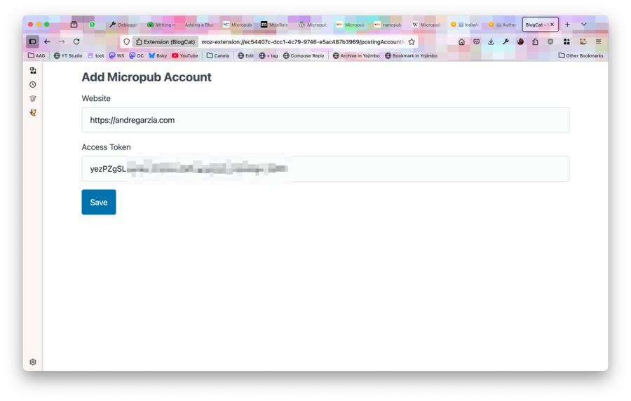

[Micropub](https://www.w3.org/TR/micropub/) is a W3C specification for client to server communications for managing blogs.

## BlogCat does not yet support OAuth or IndieAuth

Be aware that BlogCat is yet to support [IndieAuth](https://indieweb.org/IndieAuth), so at the moment it is up to you to get an access token to your Micropub endpoint. Yes, I agree this needs to change, it is on the roadmap for the next version. At the moment, you need an access token to add a new Micropub account. Many servers will allow you to go to your account preferences and create one.

## Are you a Wordpress user?

Chances are that if you have a blog, you're running Wordpress. You can use [this micropub plugin for Wordpress](https://wordpress.org/plugins/micropub/) to enable posting to your blog from BlogCat.

## Interested in what servers support Micropub?

Check out this [list](https://indieweb.org/Micropub/Servers). A big one is [micro.blog](https://micro.blog). Listen in that page are also little softwares you can self-host that will expose a Micropub endpoint and then talk to your blogging software of choice, like a middleman. There are solutions for Jekyll and Hugo if that is what floats your boat.

## Are you using micro.blog?

Micro.blog [help describes how to get an access token](https://help.micro.blog/t/authentication/98).

## Access tokens

Since there are way too many blogging services and softwares out there, it is impossible for me to create a comprehensive collection screenshots showing the process of getting access tokens. I will leave you to figure out how to do it for your software.

First you need to figure out if your blogging platform of choice supports Micropub. If they don't, go bug them to support it, but also check if there some solution to run a small Micropub server to talk to your blogging platform of choice (such as the ones listed in the link in the section above).

Once you have a Micropub enabled service, you need to get access tokens to your account.

## Adding the access token to BlogCat

Using the toolbar button, go to _Manage Posting Accounts_.


Click on _Add Micropub Account_.


Fill in your website and your access token.



Be aware that you're adding your website there and not your Micropub endpoint. BlogCat will fetch that page and look for the endpoing as a `<link>` inside `<head>`. An example from my own site:

```
<link rel="micropub" href="https://andregarzia.com/api">
```
