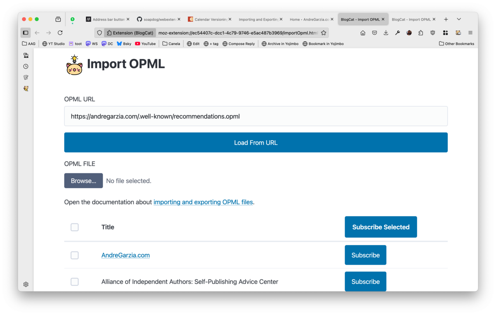

## Importing a blogroll while browsing

When you're browsing the Web, BlogCat will look for blogrolls every time you navigate to a new page. When it find one, it will display an [address bar button](https://developer.mozilla.org/en-US/docs/Mozilla/Add-ons/WebExtensions/user_interface/Page_actions) with a little cat and a lightbulb.

Clicking on it, opens a popup showing what was detected. These might include RSS, Atom and OPML blogrolls. Selecting _View blogroll_ will open the _import OPML page_ allowing you to bulk subscribe to selected websites from the OPML file.

To find blogrolls in a website, BlogCat looks for a `<link rel="blogroll>` in the HTML.

## Importing an OPML from the browser button

BlogCat browser button also allows you to navigate to the _import OPML page_ by clicking the _Import OPML_ in the popup.

## Import OPML page

You can import an OPML file from a URL or from a file. If you're using another feed reader and want to subscribe to the same websites in BlogCat, you can export your subscriptions in OPML format from that reader and import that file to BlogCat using this page.

BlogCat will list all websites it finds in the blogroll file and let you subscribe to them individually or in bulk. The default update frequency is _daily_.
