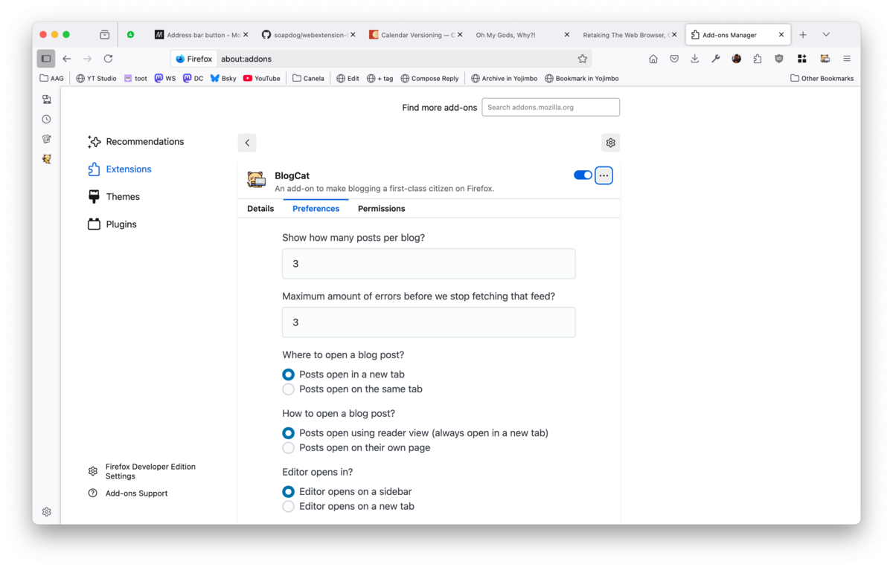

The _add-ons preferences page_ can be accessed using many ways. Either through selecting _Preferences_ from the _browser toolbar button_ or by going into Firefox settings for add-ons and clicking manage.

