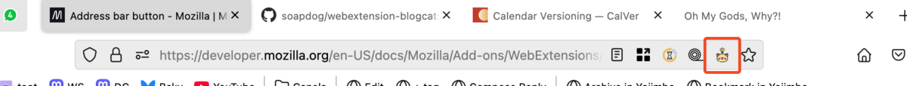
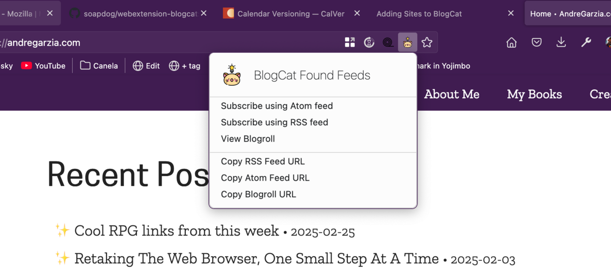

BlogCat adds an [address bar button](https://developer.mozilla.org/en-US/docs/Mozilla/Add-ons/WebExtensions/user_interface/Page_actions) (also known as a _page action_) to the browser. This button will appear when BlogCat detects either a feed or a blogroll in the page.

Clicking that button displays a popup that allows the user to access the view and subscribe to feeds and blogrolls.

