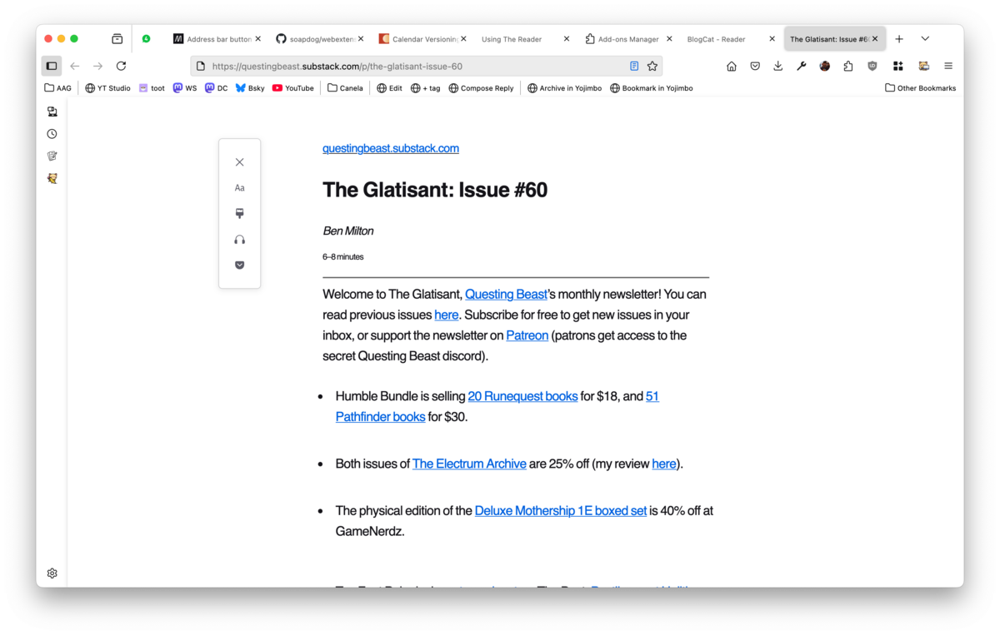

Use the _browser toolbar button_ to access the _reader page_ by clicking _Open Reader_.

Opening the reader is what causes BlogCat to fetch feeds. There is no fetching in the background. Every time you open the reader page, BlogCat will use the update frequency for each subscribed feed to decide if it should fetch it again or not and then do what it must.

The update frequency might not work exactly how you expect.

- Daily: means it will fetch it no more than once every day. Basically when you open the reader, it loops through all the feeds checking when they were last accessed, if it was not today, then it fetches them again.
- Realtime: it always fetch when you open the reader (avoid using this, it is unkind to servers).
- Weekly: That doesn't mean every seven days! There are 52 weeks in a year, this one checks the _week number_ of the last time it got the feed and the current week number, if they don't match, it fetches again. That means that opening the reader on a Friday and then again on Monday will fetch the feed twice even though fewer than seven days passed.
- Monthy: Quite simple, it checks the month number, if they don't match it fetches again.

BlogCat uses [RSS Parser](https://github.com/rbren/rss-parser) to fetch feeds. This library will send [HTTP Headers](https://developer.mozilla.org/en-US/docs/Web/HTTP/Headers) to the server with the date and etag of the last time it accessed the feed and respect their response.

Websites are listed in descending order with the most recently updates websites appearing first. At the top of the reader you can see a _navigation menu with a list of tags_. Use it to filter which sites you're focusing on. If you haven't added any tag, you'll only see the items _All_ and _Untagged_.

For each website, BlogCat will list some recent posts. The amount of posts is configurable in the _add-on preferences_ and the default value is three.

If you want to see more posts for a given website, you can click _more posts_.

You can unsubscribe to a website by clicking _remove_.

To edit a subscription, click _edit_. This will open the _add feed page_ with that feed loaded into it.

Clicking on a website title, will open the website.

Clicking on a post will navigate to the post with some user configurable options:

- A post can either open on a new tab or the same tab as the reader. The default is a new tab.
- The post can open in its own website, which is the default option, or Firefox reader view. If the user changes the preferences to open in reader view, then it will always open on a new tab.

[Firefox reader view](https://support.mozilla.org/en-US/kb/firefox-reader-view-clutter-free-web-pages) is quite elegant and provides an amazing reading experience. It can also read the post out loud for you and/or send the post to pocket.

> I use the send to pocket a lot since I got pocket setup on my [Kobo eReader](https://uk.kobobooks.com/collections/ereaders). Sending long articles from Firefox to my Kobo is such a pleasant experience, really recommend it.

BlogCat has some special features for [YouTube](youtube.md) and also for [podcasts](podcasts.md), you might want to check it out.
