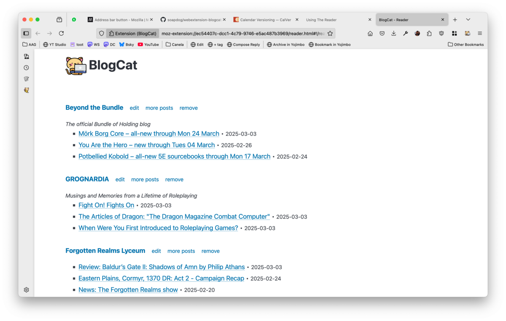

# Release 2025.3.8

## Organise your websites with tags

BlogCat now has support for tagging websites. Use the _Add feed page_ or the _Feed management page_ to add and remove tags. In the _Reader page_ use the menu on the top of the page to navigate between your tags.
