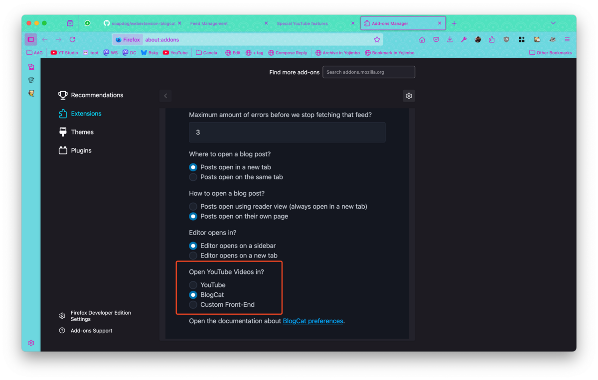
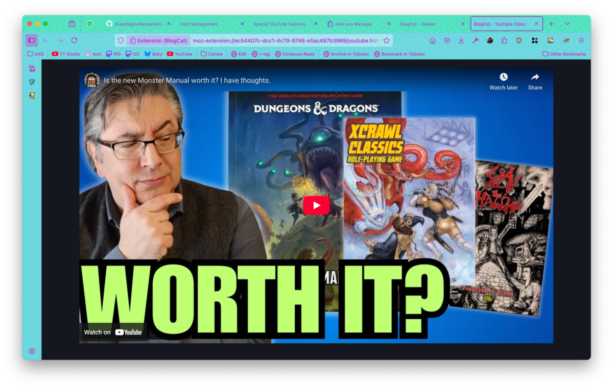
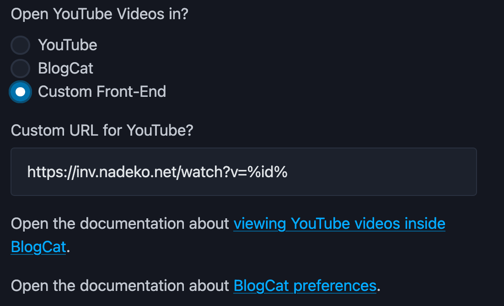

# YouTube Features

## Subscribing to YouTube channels

BlogCat can be used to subscribe to YouTube channels. Just go to the channel page and use the _address bar button_ as usual. All YouTube channel pages have feeds for the channel but they are only displayed if you load the channel page directly. If you're already browsing YouTube and navigate to a channel, the address bar button will not show up. To solve that just reload the page.

> BlogCat only inspects the page when it first loads, browsing around YouTube doesn't cause it to reload the pages and thus BlogCat can't notice that you ended up on a channel page unless you navigate directly to the page or reload the page once you are there.

Why subscribe to YouTube channels you ask? Well to keep all your subscribed websites in BlogCat and also step away from YouTube's own algorithm. YouTube is notorious for not showing you all the updates from channels you follow. Why they don't is unknown to me but I built BlogCat for various reasons and among them was to be able to actually see the videos from the channels I follow.

## Watching YouTube videos

By default, when you click on a link that is a YouTube video in the _Reader page_, BlogCat will open a new tab with the link to the video. This will load the full YouTube experience with the comments, recommendations, etc.

You can change that behaviour in the preferences and select between opening the video inside BlogCat or using an alternative front-end.

## BlogCat viewer

Selecting _BlogCat_ in the preferences will cause videos to open on their own tab inside an `<iframe>`. This will load only the video, as if you just embeded it on a blog post. There are no comments, no recommendations.

## Custom YouTube front-end

There are a lot of users that prefer to use [alternative front-ends for YouTube](https://github.com/mendel5/alternative-front-ends?tab=readme-ov-file#youtube). You can your preferred custom URL for alternative YouTube front-end in the preferences. Just use `%id%` as a placeholder for the YouTube video id.

